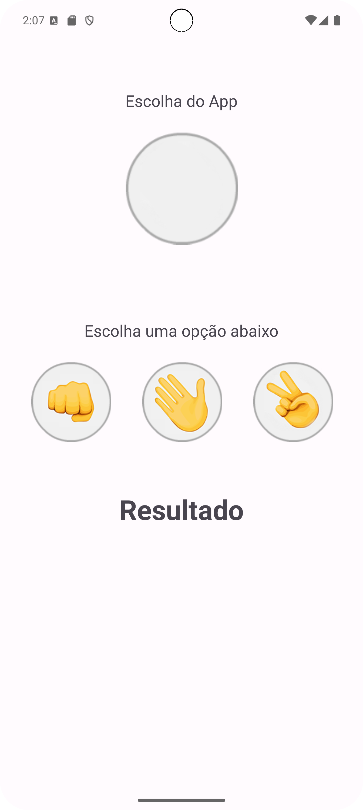
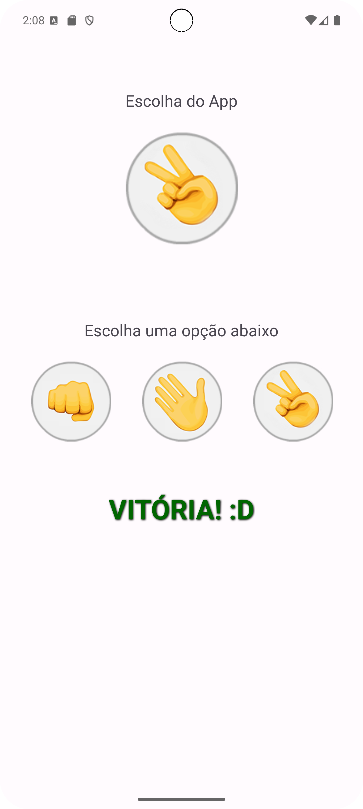
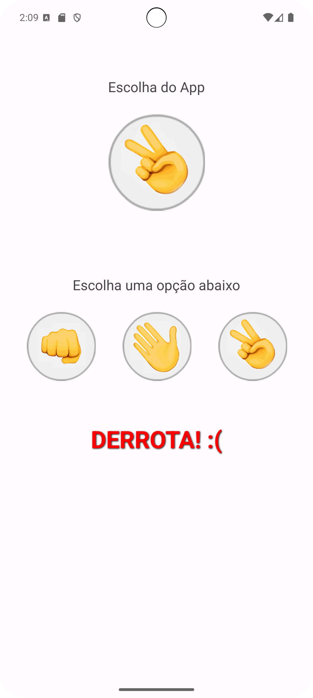
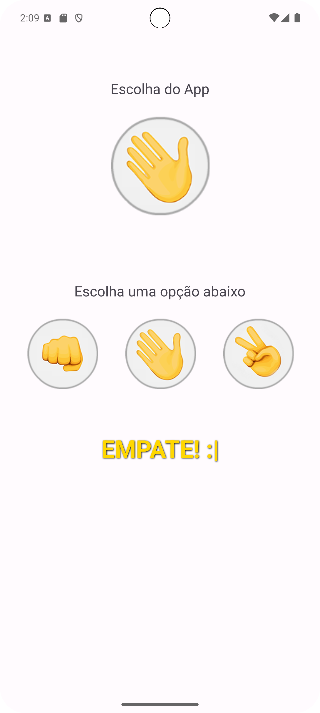

# Pedra, Papel ou Tesoura 👊✋✌️

Este é um simples jogo de **Pedra, Papel ou Tesoura** desenvolvido em **Java** no **Android Studio**, criado como parte do aprendizado de desenvolvimento para Android. Se trata de um projeto iniciante e serve como prática e treino.

---

## 🧠 **Sobre o Projeto**

O aplicativo permite que o usuário jogue contra o computador, com resultados que são gerados aleatoriamente. O objetivo principal foi aplicar conceitos fundamentais de programação e poder explorar o desenvolvimento de interfaces no Android Studio.

---

## 🎯 **Funcionalidades**

- Escolha entre as opções: **Pedra**, **Papel** ou **Tesoura**.
- Resultado gerado instantaneamente, com mensagens indicando vitória, derrota ou empate.
- Feedback visual e estilização personalizada (cores, sombras e tamanhos de texto).
- Interface amigável e simples.

---

## 🚀 **Tecnologias Utilizadas**

- **Linguagem:** Java  
- **IDE:** Android Studio  
- **API:** Android SDK

---

## 🛠️ **Como Executar o Projeto**

1. Clone este repositório:
   ```bash
   git clone https://github.com/PedroBarrosG/JoKenPo
2. Abra o projeto no Android Studio.

3. Sincronize as dependências do Gradle.

4. Execute o aplicativo em um dispositivo físico ou emulador.

## 📸 **Capturas de Tela**

### Tela Principal: Inicial


### Resultado - Vitória


### Resultado - Derrota


### Tela Principal: Empate


## 🤝 **Contribuição**
Contribuições são bem-vindas! 

